# Ctrl Shift — Business Succession Calculator

> *"You don't sell your business for the price you think you can get. You sell for the price you can prove."*

A free, shareable web calculator that shows SME owners the owner-dependency discount a buyer will apply at closing — and the premium they could recover by encoding their institutional knowledge before the sale.

Built by **[Ctrl Shift](https://ctrl-shift.ai)** (Evan Pitchie + Giovanni Brucoli), an AI consulting company focused on the SME succession planning market.

---

## What It Does

The calculator takes a business owner through two scenarios:

- **Scenario A — What a buyer sees today:** business value based on documented data only, with an owner dependency discount applied based on how much institutional knowledge lives only in the owner's head.
- **Scenario B — After encoding your knowledge:** same business, same financials, but the owner dependency risk is reduced because pricing rules, supplier relationships, SOPs, and customer context are now in a certified context layer.

**The gap between A and B is the ROI argument for a Ctrl Shift engagement.**

### Example output

```
Auto Dealer · $400,000 SDE · top customer 20% · all questions "No"

Scenario A (today):             $960,000   (2.4× effective multiple)
Scenario B (context layer):  $1,200,000   (3.0× effective multiple)

Delta:                          +$240,000
Context layer cost:             $15k–$25k
ROI:                            9.6–16×
```

---

## How It Works — Calculation Map

```mermaid
flowchart TD
    subgraph INPUTS["📋 Inputs"]
        IND["Industry\n(dropdown — 15 options)"]
        EARN["Annual Earnings\nSDE / EBITDA / Revenue"]
        CONC["Top Customer %\n(slider)"]
        YRS["Years in Business"]
    end

    subgraph QUESTIONS["🔍 8 Owner Dependency Questions (Value Builder: Hub & Spoke)"]
        direction TB
        Q1["🔑 Can business run 30d without you?\nweight: 20"]
        Q2["💲 Pricing rules documented?\nweight: 15"]
        Q3["🤝 Supplier relationships documented?\nweight: 15"]
        Q4["📋 Written SOPs for core workflows?\nweight: 15"]
        Q5["👥 Management team in place?\nweight: 15"]
        Q6["🧑‍💼 Customer relationships tied to business?\nweight: 10"]
        Q7["📊 3 years of clean financials?\nweight: 5"]
        Q8["📝 Written succession plan?\nweight: 5"]
    end

    subgraph SCORING["🧮 Scoring Engine"]
        DEP_SCORE["Owner Dependency Score\n0–100 (sum of checked weights)"]
        ADJ_A["Multiple Adjustment — Scenario A\n≥85 → +0.3×\n≥70 →  0.0×\n≥55 → -0.4×\n≥40 → -0.8×\n≥25 → -1.2×\n<25  → -1.8×"]
        IMP_SCORE["Improved Score — Scenario B\n4 dims flipped by context layer\n+pricing +supplier +SOPs +customers"]
        ADJ_B["Multiple Adjustment — Scenario B\n(same lookup, improved score)"]
        CONC_ADJ["Concentration Adjustment\n>50% → -0.5×\n>25% → -0.2×\n≤25% →  0.0×"]
    end

    subgraph MULTIPLES["📊 Industry Base Multiple (BizBuySell / IBBA)"]
        BASE["Mid multiple by industry\ne.g. Auto Dealer → 3.2×\nIT/MSP → 5.5×\nRestaurant → 2.3×"]
    end

    subgraph CONTEXT["🧱 Context Layer (4 of 8 dimensions)"]
        CL1["Pricing rules"]
        CL2["Supplier relationships"]
        CL3["Core SOPs"]
        CL4["Customer relationships"]
    end

    subgraph OUTPUT["📈 Outputs"]
        SCENA["Scenario A — Today\nbase + dep_adj_A + conc_adj\n= Effective Multiple A\n× earnings = Sale Price A"]
        SCENB["Scenario B — After context layer\nbase + dep_adj_B + conc_adj\n= Effective Multiple B\n× earnings = Sale Price B"]
        DELTA["💰 Valuation Gap\nB − A"]
        ROI["ROI\nGap ÷ engagement cost\n(scales with earnings size)"]
    end

    IND --> BASE
    EARN --> SCENA
    EARN --> SCENB
    CONC --> CONC_ADJ

    Q1 & Q2 & Q3 & Q4 & Q5 & Q6 & Q7 & Q8 --> DEP_SCORE
    DEP_SCORE --> ADJ_A

    CL1 & CL2 & CL3 & CL4 -->|"flip 'No' → 'Yes'"| IMP_SCORE
    IMP_SCORE --> ADJ_B

    BASE --> SCENA
    BASE --> SCENB
    ADJ_A --> SCENA
    ADJ_B --> SCENB
    CONC_ADJ --> SCENA
    CONC_ADJ --> SCENB

    SCENA --> DELTA
    SCENB --> DELTA
    DELTA --> ROI

    style INPUTS fill:#e3f2fd,stroke:#1565c0
    style QUESTIONS fill:#fff8e1,stroke:#f57f17
    style SCORING fill:#f3e5f5,stroke:#6a1b9a
    style MULTIPLES fill:#e8f5e9,stroke:#2e7d32
    style CONTEXT fill:#fce4ec,stroke:#880e4f
    style OUTPUT fill:#e0f7fa,stroke:#006064
    style DELTA fill:#c8e6c9,stroke:#2e7d32,color:#1b5e20
    style ROI fill:#c8e6c9,stroke:#2e7d32
```



---

## Run Locally

```bash
git clone https://github.com/dataappengineer/succession-calculator.git
cd succession-calculator
pip install -r requirements.txt
streamlit run app.py
```

The app opens at `http://localhost:8501`.

---

## Deploy to Streamlit Community Cloud (one click)

1. Fork or push this repo to your GitHub account (must be public).
2. Go to **[share.streamlit.io](https://share.streamlit.io)** and sign in with GitHub.
3. Click **"New app"** → select your repo → set the **main file path** to `app.py`.
4. Click **"Deploy"**. No secrets, no environment variables required.

You'll get a shareable URL like `https://your-app-name.streamlit.app` within ~2 minutes.

---

## Data Sources

Industry SDE/EBITDA multiples and owner dependency discount methodology are sourced from:

- **BizBuySell 2024 Insight Report** — annual survey of closed small business transactions in the US
- **IBBA Market Pulse Q4 2024** — International Business Brokers Association quarterly benchmark report

All numbers are rule-based and fully traceable. No ML models. No random numbers. Every adjustment is explainable.

---

## Stack

| Layer | Technology |
|---|---|
| UI & logic | Python + Streamlit |
| Hosting | Streamlit Community Cloud (free) |
| Data | Hardcoded lookup tables — no database |
| Dependencies | `streamlit`, `pandas` |

---

## Contact

Questions or partnership inquiries: **evan@ctrl-shift.ai**  
Website: [ctrl-shift.ai](https://ctrl-shift.ai)
