# Ctrl Shift — Business Succession Calculator

> *"You don't sell your business for the price you think you can get. You sell for the price you can prove."*

A free, shareable web calculator that shows SME owners the owner-dependency discount a buyer will apply at closing — and the premium they could recover by encoding their institutional knowledge before the sale.

Built by **[Ctrl Shift](https://ctrl-shift.ai)** (Evan Pitchie + Giovanni Brucoli), an AI consulting company focused on the SME succession planning market.

---

## What It Does

The calculator takes a business owner through two scenarios and produces a comprehensive diagnostic report:

- **Scenario A — What a buyer sees today:** business value with an owner dependency discount applied based on how much institutional knowledge lives only in the owner's head.
- **Scenario B — After encoding your knowledge:** same business, same financials, but the owner dependency risk is reduced because pricing rules, supplier relationships, SOPs, and customer context are now in a certified context layer.

**The gap between A and B is the ROI argument for a Ctrl Shift engagement.**

### Report output (after clicking "Calculate My Valuation Gap")

The results section produces a detailed diagnostic report with the following structure:

1. **Tier badge + dynamic headline** — one of six risk tiers (BUYER-READY → CRITICAL RISK) with a colour-coded assessment and a specific headline calibrated to the owner's score.
2. **Four metric cards** — Owner Dependency Score, Effective Multiple Today, Estimated Sale Price Today, and Recoverable Value.
3. **Tier narrative + symptom bullets** — a detailed paragraph explaining what the score means in a real M&A context, followed by the specific patterns buyers and their advisors typically find at that risk level.
4. **Concentration risk callout** — if the top customer exceeds 25% of revenue, a separate flag explains the additional multiple discount and what buyers probe for.
5. **Per-question risk flag breakdown** — every "No" answer surfaces as a red-bordered card showing: the risk label, the specific implication for a buyer, the buyer due diligence flag, and whether the context layer fixes it. Every "Yes" answer surfaces as a green-bordered card with a note on how it positively affects the valuation.
6. **Scenario A vs Scenario B comparison cards** — two side-by-side styled cards showing the full multiple math (base + dependency adjustment + concentration adjustment = effective multiple × earnings = sale price).
7. **Valuation gap box** — a green-bordered summary with three sub-cards: valuation gap, context layer investment range, and estimated ROI.
8. **"What exactly does the context layer change?" expander** — per-gap cards for each fixable dimension (what gets documented, how, and what the buyer sees as a result).
9. **"What does a buyer's due diligence actually look for?" expander** — detailed educational section covering financial, operational, commercial, legal, and knowledge/transition due diligence.
10. **CTA card** — contact block with mailto and website links for booking a discovery call.

### Example figures

```
Auto Dealer · $400,000 SDE · top customer 20% · all questions "No"
Owner Dependency Score: 0/100 → CRITICAL RISK tier

Scenario A (today):          $1,000,000   (2.5× effective multiple after −1.8× dep. adj.)
Scenario B (context layer):  $1,480,000   (3.7× effective multiple after −0.8× dep. adj.)

Valuation gap:                 +$480,000
Context layer investment:       $25k–$40k
Estimated ROI:                  12–19×
```

---

## The Math

**Inputs**

| Symbol | Meaning |
|---|---|
| $I$ | Industry (categorical) |
| $E$ | Annual earnings — SDE, EBITDA, or Revenue |
| $c$ | Top customer share of revenue (%) |
| $\mathbf{a} = (a_1, \ldots, a_8)$ | Binary answers to the 8 dependency questions, $a_i \in \{0,1\}$ |

---

**Owner Dependency Score**

Weights $\mathbf{w} = (20, 15, 15, 15, 15, 10, 5, 5)$ correspond to the 8 questions in order.

$$S = \sum_{i=1}^{8} w_i \cdot a_i, \qquad S \in [0,\, 100]$$

---

**Industry Base Multiple**

$$M_{\text{base}} = \text{lookup}(I)$$

e.g. Auto Dealer → $3.2\times$, IT/MSP → $5.5\times$, Restaurant → $2.3\times$

---

**Multiple Adjustment** (piecewise, based on dependency score)

$$
\delta(S) = \begin{cases}
+0.3 & S \geq 85 \\
+0.0 & 70 \leq S < 85 \\
-0.4 & 55 \leq S < 70 \\
-0.8 & 40 \leq S < 55 \\
-1.2 & 25 \leq S < 40 \\
-1.8 & S < 25
\end{cases}
$$

---

**Concentration Adjustment**

$$
\gamma(c) = \begin{cases}
-0.5 & c > 50\% \\
-0.2 & 25\% < c \leq 50\% \\
+0.0 & c \leq 25\%
\end{cases}
$$

---

**Scenario A — Today**

$$M_A = \max\bigl(M_{\text{base}} + \delta(S) + \gamma(c),\; 0.5\bigr)$$

$$P_A = E \times M_A$$

---

**Context Layer — Improved Score**

The context layer forces $a_i = 1$ for the 4 dimensions it encodes (pricing, supplier, SOPs, customer relationships — indices 2, 3, 4, 6). Define $\mathbf{a}'$ as $\mathbf{a}$ with those four entries flipped:

$$S' = S + \sum_{i \in \{2,3,4,6\}} w_i \cdot (1 - a_i)$$

The incremental lift $S' - S$ is zero for owners who already documented those dimensions, and up to $+55$ points for owners who answered "No" to all four.

---

**Scenario B — After Context Layer**

$$M_B = \max\bigl(M_{\text{base}} + \delta(S') + \gamma(c),\; 0.5\bigr)$$

$$P_B = E \times M_B$$

---

**Valuation Gap**

$$\Delta = P_B - P_A = E \cdot (M_B - M_A)$$

---

**Engagement Cost & ROI**

Cost scales with earnings size:

$$
[C_{\text{low}},\, C_{\text{high}}] = \begin{cases}
[\$8k,\, \$15k] & E < \$100k \\
[\$15k,\, \$25k] & \$100k \leq E < \$300k \\
[\$25k,\, \$40k] & \$300k \leq E < \$600k \\
[\$40k,\, \$65k] & E \geq \$600k
\end{cases}
$$

$$\text{ROI} \in \left[\frac{\Delta}{C_{\text{high}}},\; \frac{\Delta}{C_{\text{low}}}\right]$$

---

## How It Works — Calculation Map

```mermaid
flowchart TD
    subgraph INPUTS["📋 Inputs"]
        IND["Industry\n(dropdown — 15 options)"]
        EARN["Annual Earnings\nSDE / EBITDA / Revenue"]
        CONC["Top Customer %\n(slider)"]
        YRS["Years in Business"]
    end

    subgraph QUESTIONS["🔍 8 Owner Dependency Questions (Value Builder: Hub & Spoke)"]
        direction TB
        Q1["🔑 Can business run 30d without you?\nweight: 20"]
        Q2["💲 Pricing rules documented?\nweight: 15"]
        Q3["🤝 Supplier relationships documented?\nweight: 15"]
        Q4["📋 Written SOPs for core workflows?\nweight: 15"]
        Q5["👥 Management team in place?\nweight: 15"]
        Q6["🧑‍💼 Customer relationships tied to business?\nweight: 10"]
        Q7["📊 3 years of clean financials?\nweight: 5"]
        Q8["📝 Written succession plan?\nweight: 5"]
    end

    subgraph SCORING["🧮 Scoring Engine"]
        DEP_SCORE["Owner Dependency Score\n0–100 (sum of checked weights)"]
        ADJ_A["Multiple Adjustment — Scenario A\n≥85 → +0.3×\n≥70 →  0.0×\n≥55 → -0.4×\n≥40 → -0.8×\n≥25 → -1.2×\n<25  → -1.8×"]
        IMP_SCORE["Improved Score — Scenario B\n4 dims flipped by context layer\n+pricing +supplier +SOPs +customers"]
        ADJ_B["Multiple Adjustment — Scenario B\n(same lookup, improved score)"]
        CONC_ADJ["Concentration Adjustment\n>50% → -0.5×\n>25% → -0.2×\n≤25% →  0.0×"]
    end

    subgraph MULTIPLES["📊 Industry Base Multiple (BizBuySell / IBBA)"]
        BASE["Mid multiple by industry\ne.g. Auto Dealer → 3.2×\nIT/MSP → 5.5×\nRestaurant → 2.3×"]
    end

    subgraph CONTEXT["🧱 Context Layer (4 of 8 dimensions)"]
        CL1["Pricing rules"]
        CL2["Supplier relationships"]
        CL3["Core SOPs"]
        CL4["Customer relationships"]
    end

    subgraph OUTPUT["📈 Outputs"]
        SCENA["Scenario A — Today\nbase + dep_adj_A + conc_adj\n= Effective Multiple A\n× earnings = Sale Price A"]
        SCENB["Scenario B — After context layer\nbase + dep_adj_B + conc_adj\n= Effective Multiple B\n× earnings = Sale Price B"]
        DELTA["💰 Valuation Gap\nB − A"]
        ROI["ROI\nGap ÷ engagement cost\n(scales with earnings size)"]
    end

    IND --> BASE
    EARN --> SCENA
    EARN --> SCENB
    CONC --> CONC_ADJ

    Q1 & Q2 & Q3 & Q4 & Q5 & Q6 & Q7 & Q8 --> DEP_SCORE
    DEP_SCORE --> ADJ_A

    CL1 & CL2 & CL3 & CL4 -->|"flip 'No' → 'Yes'"| IMP_SCORE
    IMP_SCORE --> ADJ_B

    BASE --> SCENA
    BASE --> SCENB
    ADJ_A --> SCENA
    ADJ_B --> SCENB
    CONC_ADJ --> SCENA
    CONC_ADJ --> SCENB

    SCENA --> DELTA
    SCENB --> DELTA
    DELTA --> ROI

    style INPUTS fill:#e3f2fd,stroke:#1565c0
    style QUESTIONS fill:#fff8e1,stroke:#f57f17
    style SCORING fill:#f3e5f5,stroke:#6a1b9a
    style MULTIPLES fill:#e8f5e9,stroke:#2e7d32
    style CONTEXT fill:#fce4ec,stroke:#880e4f
    style OUTPUT fill:#e0f7fa,stroke:#006064
    style DELTA fill:#c8e6c9,stroke:#2e7d32,color:#1b5e20
    style ROI fill:#c8e6c9,stroke:#2e7d32
```



---

## Run Locally

```bash
git clone https://github.com/dataappengineer/succession-calculator.git
cd succession-calculator
pip install -r requirements.txt
streamlit run app.py
```

The app opens at `http://localhost:8501`.

---

## Deploy to Streamlit Community Cloud (one click)

1. Fork or push this repo to your GitHub account (must be public).
2. Go to **[share.streamlit.io](https://share.streamlit.io)** and sign in with GitHub.
3. Click **"New app"** → select your repo → set the **main file path** to `app.py`.
4. Click **"Deploy"**. No secrets, no environment variables required.

You'll get a shareable URL like `https://your-app-name.streamlit.app` within ~2 minutes.

---

## Data Sources

Industry SDE/EBITDA multiples and owner dependency discount methodology are sourced from:

- **BizBuySell 2024 Insight Report** — annual survey of closed small business transactions in the US
- **IBBA Market Pulse Q4 2024** — International Business Brokers Association quarterly benchmark report

All numbers are rule-based and fully traceable. No ML models. No random numbers. Every adjustment is explainable.

---

## Stack

| Layer | Technology |
|---|---|
| UI & logic | Python + Streamlit |
| Hosting | Streamlit Community Cloud (free) |
| Data | Hardcoded lookup tables — no database |
| Dependencies | `streamlit`, `pandas` |

---

## Contact

Questions or partnership inquiries: **evan@ctrl-shift.ai**  
Website: [ctrl-shift.ai](https://ctrl-shift.ai)
